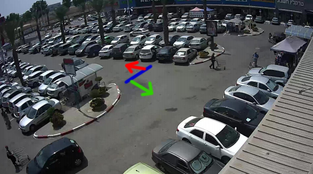
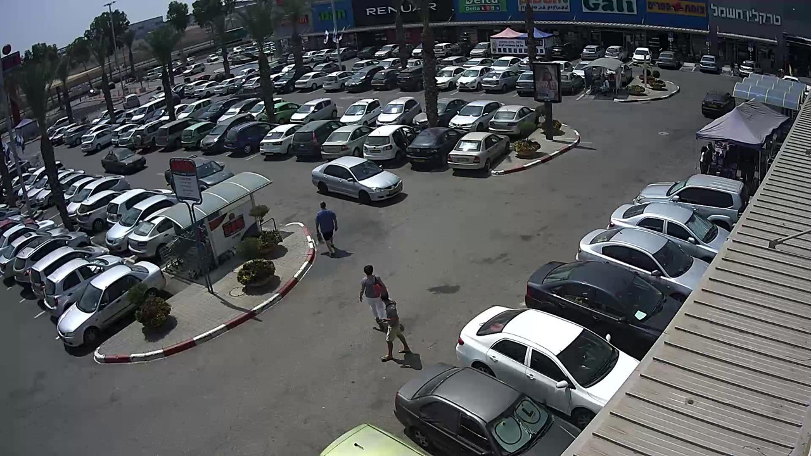
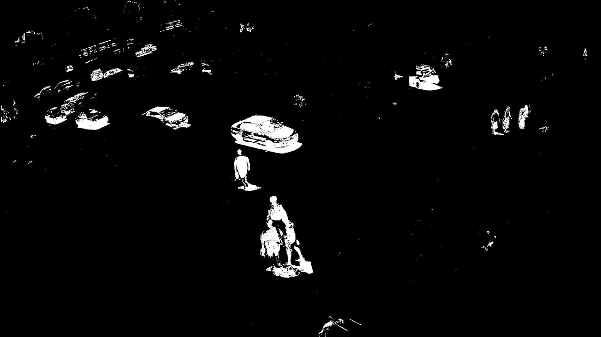
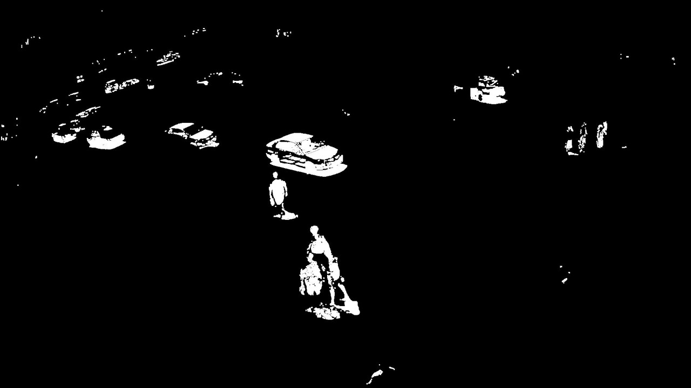
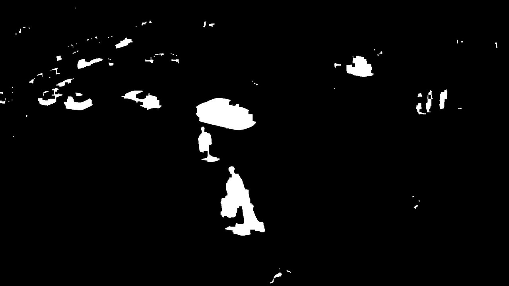
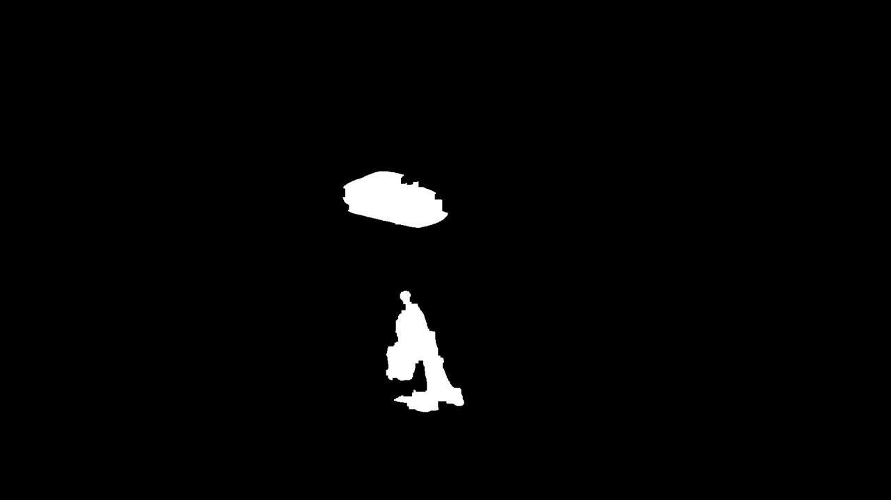

# car_detection_and_tracking

We would like to measure how many vehicles cross a certain line and their movement direction while
crossing it.
For example, in the frame below, we would like to know how many vehicles crossed the blue line while
moving in the red arrow direction and how many crossed while moving in the green arrow direction.

## detecting the cars in the image
Find background using a Gaussian model

Subtract background

Morphologically open image

Morphologically close image

Fill image regions and holes

Filter by size

Remove Images Classified as non Cars

